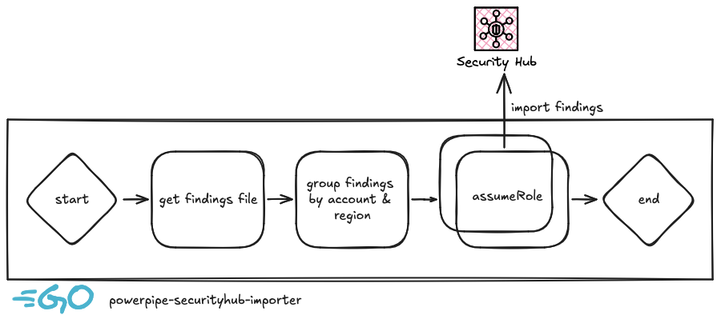

# Powerpipe AWS SecurityHub Findings Importer

Import your [Powerpipe](https://powerpipe.io/) AWS ASFF findings into AWS SecurityHub in all your AWS Accounts and Regions!


## What is this?

*powerpipe-securityhub-importer* is tool that imports Powerpipe ASFF findings from different AWS Accounts and Regions into AWS SecurityHub.

We have created this tool to facilitate the integration between Powerpipe and AWS SecurityHub when working with different AWS Accounts and Regions.

You cannot import directly your findings to your centralized SecurityHub account. When working with multiple accounts or regions, it is required to import the findings into **their** account and region.



## Features

- Import Powerpipe ASFF findings into AWS SecurityHub for each AWS Account and Region.
- Skip `PASSED` and `NOT_AVAILABLE` findings if desired.
- It is fast! :rocket:

> [!NOTE]
> Are you using Steampipe in your AWS Organizations? Check [steampipe-config-generator](https://github.com/unicrons/steampipe-config-generator) tool!

## Requirements

- An AWS IAM Role deployed in all your AWS accounts with:
  - A trust policy that allows `sts:AssumeRole` from a central role.
  - Permissions to import SecurityHub findings:
  ```json
  {
    "Sid": "SecurityHubImport",
    "Effect": "Allow",
    "Action": [
      "securityhub:BatchImportFindings"
    ],
    "Resource": "*"
  }
  ```
- Valid AWS credentials with the needed permissions to assume the distributed IAM Role:
  ```json
  {
    "Sid": "AssumeSecurityImportRole",
    "Effect": "Allow",
    "Action": [
      "sts:AssumeRole"
    ],
    "Resource": "arn:aws:iam::*:role/role-name-with-path"
  }
  ```

> [!TIP]
> Check our post [Deploy IAM Roles across an AWS Organization as code](https://unicrons.cloud/en/2024/10/14/deploy-iam-roles-across-an-aws-organization-as-code/) to know how to deploy the needed IAM role in all your AWS accounts!


## How to use it

```bash
./powerpipe-securityhub-importer --role role-name-with-path --findings ./findings.asff.json
```

To skip `PASSED` and `NOT_AVAILABLE` findings, add `--only-failed`.

Run `./powerpipe-securityhub-importer --help` for the full list of flags, and
`./powerpipe-securityhub-importer --version` to print the installed version.


## Versioning

This project follows [Semantic Versioning](https://semver.org/): breaking changes (to CLI flags
or to the Go library API in `importer/`) bump the major version, new features bump the minor
version, and fixes bump the patch version. See [CHANGELOG.md](./CHANGELOG.md) for what changed in
each release.


## Contribute

Do you see any issue? Something to improve? A new feature? Open a Github Issue or submit a PR!   
We welcome all contributors!
